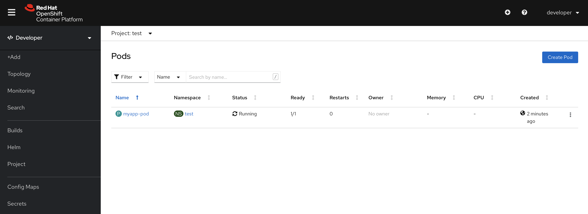

# Pod

## Prerequisites

Having completed the following labs:

- [00 - Prerequisites](../00-Prerequisites/README.md)
- [02 - Provision the environment](../02-Provision_the_environment/README.md)
- [03 - OKD login](../03-OKD_login/README.md)
- [04 - Project](../04-Project/README.md)

Having logged in using a developer account:

```console
$ oc login -u developer -p developer https://api.crc.testing:6443     
Login successful.

You have one project on this server: "test"

Using project "test".
```

Make sure to use the **test** project.

```console
$ oc project test
Already on project "test" on server "https://api.crc.testing:6443".
```

## Single container Pod

Start a single container Pod

```console
$ oc apply -f single-container_pod.yaml
```

Get the Pod status

```console
$ oc get pods
NAME        READY   STATUS    RESTARTS   AGE           
myapp-pod   1/1     Running   0          16s
```



Discover where the Pod has been scheduled
```console
$ oc get pod myapp-pod -o wide
NAME        READY   STATUS    RESTARTS   AGE     IP            NODE                 NOMINATED NODE   READINESS GATES
myapp-pod   1/1     Running   0          3m29s   10.116.0.57   crc-j55b9-master-0   <none>           <none>
```

Get the Pod's container logs
```console
$ oc logs myapp-pod 
Hello Kubernetes!
```

Cleanup!

```console
$ oc delete -f single-container_pod.yaml
pod "myapp-pod" deleted
```


## Two containers Pod

Create the Pod
```console
$ oc apply -f two-containers_pod.yaml
pod/mc1 created
```

Try to get the Pod status
```console
$ oc get pods
NAME   READY   STATUS              RESTARTS   AGE
mc1    0/2     ContainerCreating   0          114s
```

If you repeat the command after a while

```console
$ oc get pods
NAME   READY   STATUS    RESTARTS   AGE
mc1    2/2     Running   0          3m30s
```

Get the Pod configuration in YAML format

```console
$ oc get pod mc1 -o yaml
apiVersion: v1
kind: Pod
metadata:
  annotations:
    k8s.v1.cni.cncf.io/network-status: |-
      [{
          "name": "openshift-sdn",
          "interface": "eth0",
          "ips": [
              "10.116.0.59"
          ],
          "default": true,
          "dns": {}
      }]
    k8s.v1.cni.cncf.io/networks-status: |-
      [{
          "name": "openshift-sdn",
          "interface": "eth0",
          "ips": [
              "10.116.0.59"
          ],
          "default": true,
          "dns": {}
      }]
    kubectl.kubernetes.io/last-applied-configuration: |
      {"apiVersion":"v1","kind":"Pod","metadata":{"annotations":{},"name":"mc1","namespace":"test"},"spec":{"containers":[{"image":"nginx","name":"first","volumeMounts":[{"mountPath":"/usr/share/nginx/html","name":"html"}]},{"args":["while true; do date \u003e\u003e /html/index.html; sleep 1; done"],"command":["/bin/sh","-c"],"image":"debian","name":"second","volumeMounts":[{"mountPath":"/html","name":"html"}]}],"volumes":[{"emptyDir":{},"name":"html"}]}}
    openshift.io/scc: anyuid
  creationTimestamp: "2020-10-26T22:10:50Z"
  managedFields:
  - apiVersion: v1
    fieldsType: FieldsV1
    fieldsV1:
      f:metadata:
        f:annotations:
          .: {}
          f:kubectl.kubernetes.io/last-applied-configuration: {}
      f:spec:
        f:containers:
          k:{"name":"first"}:
            .: {}
            f:image: {}
            f:imagePullPolicy: {}
            f:name: {}
            f:resources: {}
            f:terminationMessagePath: {}
            f:terminationMessagePolicy: {}
            f:volumeMounts:
              .: {}
              k:{"mountPath":"/usr/share/nginx/html"}:
                .: {}
                f:mountPath: {}
                f:name: {}
          k:{"name":"second"}:
            .: {}
            f:args: {}
            f:command: {}
            f:image: {}
            f:imagePullPolicy: {}
            f:name: {}
            f:resources: {}
            f:terminationMessagePath: {}
            f:terminationMessagePolicy: {}
            f:volumeMounts:
              .: {}
              k:{"mountPath":"/html"}:
                .: {}
                f:mountPath: {}
                f:name: {}
        f:dnsPolicy: {}
        f:enableServiceLinks: {}
        f:restartPolicy: {}
        f:schedulerName: {}
        f:securityContext: {}
        f:terminationGracePeriodSeconds: {}
        f:volumes:
          .: {}
          k:{"name":"html"}:
            .: {}
            f:emptyDir: {}
            f:name: {}
    manager: oc
    operation: Update
    time: "2020-10-26T22:10:50Z"
  - apiVersion: v1
    fieldsType: FieldsV1
    fieldsV1:
      f:metadata:
        f:annotations:
          f:k8s.v1.cni.cncf.io/network-status: {}
          f:k8s.v1.cni.cncf.io/networks-status: {}
    manager: multus
    operation: Update
    time: "2020-10-26T22:10:52Z"
  - apiVersion: v1
    fieldsType: FieldsV1
    fieldsV1:
      f:status:
        f:conditions:
          k:{"type":"ContainersReady"}:
            .: {}
            f:lastProbeTime: {}
            f:lastTransitionTime: {}
            f:status: {}
            f:type: {}
          k:{"type":"Initialized"}:
            .: {}
            f:lastProbeTime: {}
            f:lastTransitionTime: {}
            f:status: {}
            f:type: {}
          k:{"type":"Ready"}:
            .: {}
            f:lastProbeTime: {}
            f:lastTransitionTime: {}
            f:status: {}
            f:type: {}
        f:containerStatuses: {}
        f:hostIP: {}
        f:phase: {}
        f:podIP: {}
        f:podIPs:
          .: {}
          k:{"ip":"10.116.0.59"}:
            .: {}
            f:ip: {}
        f:startTime: {}
    manager: kubelet
    operation: Update
    time: "2020-10-26T22:11:01Z"
  name: mc1
  namespace: test
  resourceVersion: "358220"
  selfLink: /api/v1/namespaces/test/pods/mc1
  uid: 336a4f74-6930-450f-a57b-1efb7d29fa78
spec:
  containers:
  - image: nginx
    imagePullPolicy: Always
    name: first
    resources: {}
    securityContext:
      capabilities:
        drop:
        - MKNOD
    terminationMessagePath: /dev/termination-log
    terminationMessagePolicy: File
    volumeMounts:
    - mountPath: /usr/share/nginx/html
      name: html
    - mountPath: /var/run/secrets/kubernetes.io/serviceaccount
      name: default-token-gjtlb
      readOnly: true
  - args:
    - while true; do date >> /html/index.html; sleep 1; done
    command:
    - /bin/sh
    - -c
    image: debian
    imagePullPolicy: Always
    name: second
    resources: {}
    securityContext:
      capabilities:
        drop:
        - MKNOD
    terminationMessagePath: /dev/termination-log
    terminationMessagePolicy: File
    volumeMounts:
    - mountPath: /html
      name: html
    - mountPath: /var/run/secrets/kubernetes.io/serviceaccount
      name: default-token-gjtlb
      readOnly: true
  dnsPolicy: ClusterFirst
  enableServiceLinks: true
  imagePullSecrets:
  - name: default-dockercfg-2hbgj
  nodeName: crc-j55b9-master-0
  priority: 0
  restartPolicy: Always
  schedulerName: default-scheduler
  securityContext:
    seLinuxOptions:
      level: s0:c24,c14
  serviceAccount: default
  serviceAccountName: default
  terminationGracePeriodSeconds: 30
  tolerations:
  - effect: NoExecute
    key: node.kubernetes.io/not-ready
    operator: Exists
    tolerationSeconds: 300
  - effect: NoExecute
    key: node.kubernetes.io/unreachable
    operator: Exists
    tolerationSeconds: 300
  volumes:
  - emptyDir: {}
    name: html
  - name: default-token-gjtlb
    secret:
      defaultMode: 420
      secretName: default-token-gjtlb
status:
  conditions:
  - lastProbeTime: null
    lastTransitionTime: "2020-10-26T22:10:50Z"
    status: "True"
    type: Initialized
  - lastProbeTime: null
    lastTransitionTime: "2020-10-26T22:11:01Z"
    status: "True"
    type: Ready
  - lastProbeTime: null
    lastTransitionTime: "2020-10-26T22:11:01Z"
    status: "True"
    type: ContainersReady
  - lastProbeTime: null
    lastTransitionTime: "2020-10-26T22:10:50Z"
    status: "True"
    type: PodScheduled
  containerStatuses:
  - containerID: cri-o://0997d1b61e436a45dea95c954c667ea66584f20ec0abe7277f7aa95ab8fd23b8
    image: docker.io/library/nginx:latest
    imageID: docker.io/library/nginx@sha256:4949aa7259aa6f827450207db5ad94cabaa9248277c6d736d5e1975d200c7e43
    lastState: {}
    name: first
    ready: true
    restartCount: 0
    started: true
    state:
      running:
        startedAt: "2020-10-26T22:10:57Z"
  - containerID: cri-o://cc9bb251295600de36f89f6929615e7d26524927e4f131ea8d8bafcf81c8e73d
    image: docker.io/library/debian:latest
    imageID: docker.io/library/debian@sha256:60cb30babcd1740309903c37d3d408407d190cf73015aeddec9086ef3f393a5d
    lastState: {}
    name: second
    ready: true
    restartCount: 0
    started: true
    state:
      running:
        startedAt: "2020-10-26T22:11:00Z"
  hostIP: 192.168.126.11
  phase: Running
  podIP: 10.116.0.59
  podIPs:
  - ip: 10.116.0.59
  qosClass: BestEffort
  startTime: "2020-10-26T22:10:50Z"
```

Cleanup!

```console
$ oc delete -f two-containers_pod.yaml
pod "mc1" deleted
```

## Resource constrained Pod

Inspect the YAML file
```console
$ cat resources-constrained_pod.yaml
apiVersion: v1
kind: Pod
metadata:
  name: frontend
spec:
  containers:
  - name: db
    image: mysql
    env:
    - name: MYSQL_ROOT_PASSWORD
      value: "password"
    resources:
      requests:
        memory: "64Mi"
        cpu: "250m"
      limits:
        memory: "128Mi"
        cpu: "500m"
  - name: wp
    image: wordpress
    resources:
      requests:
        memory: "64Mi"
        cpu: "250m"
      limits:
        memory: "128Mi"
        cpu: "500m"
```

Apply the YAML file

```console
$ oc apply -f resources-constrained_pod.yaml
pod/frontend created
```

```console
$ oc get pods
NAME       READY   STATUS    RESTARTS   AGE
frontend   2/2     Running   0          44s
```

```console
$ oc get pod frontend -o wide
NAME       READY   STATUS    RESTARTS   AGE     IP            NODE                 NOMINATED NODE   READINESS GATES
frontend   2/2     Running   0          3m56s   10.116.0.60   crc-j55b9-master-0   <none>           <none>
```

```console
$ oc delete -f resources-constrained_pod.yaml
pod "frontend" deleted
```

