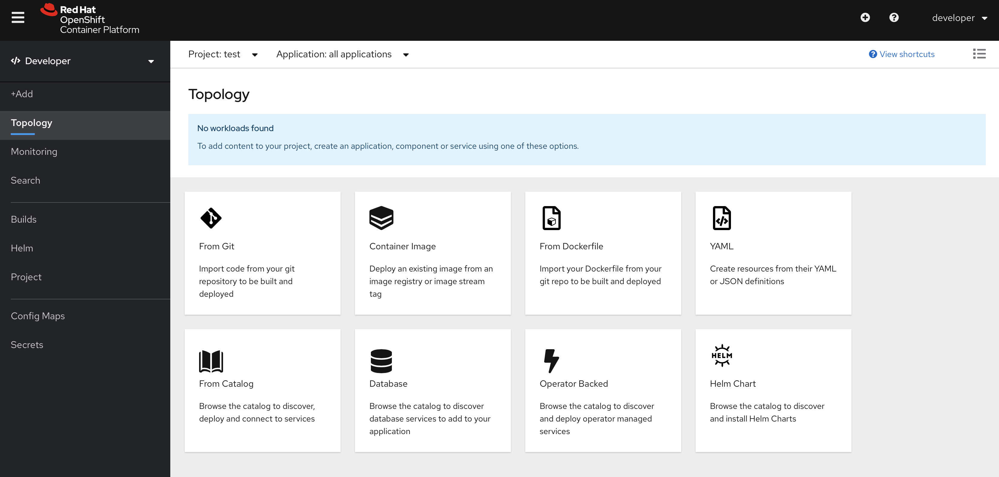
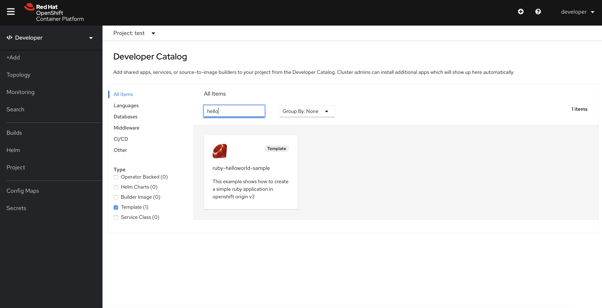
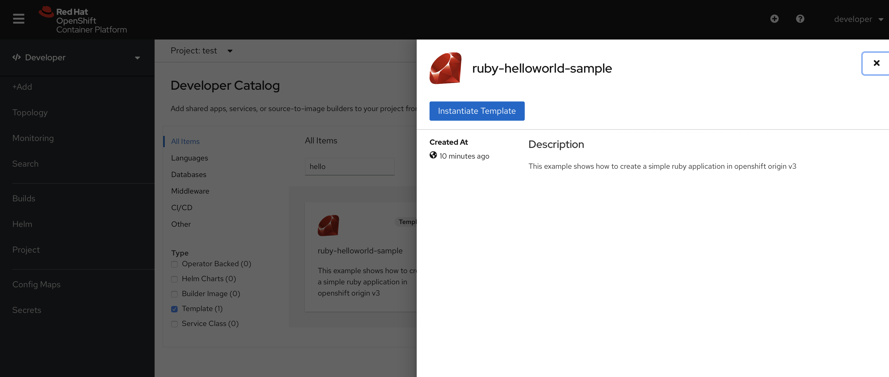
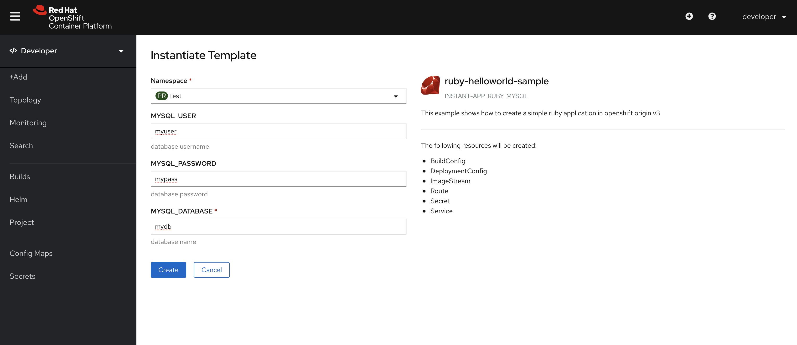
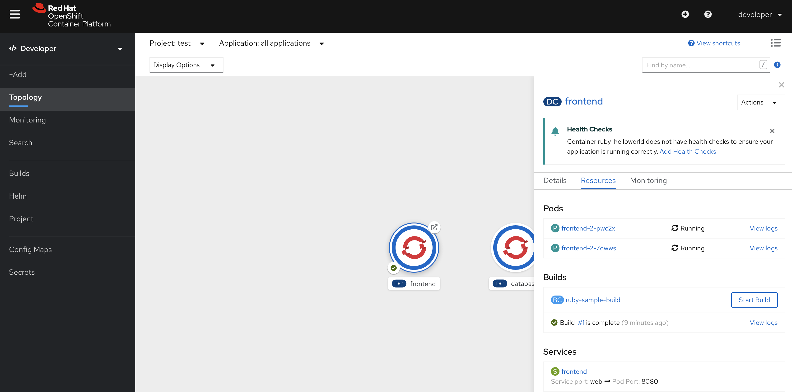

# Template 

A template describes a set of objects that can be parameterized and processed to produce a list of objects for creation by OpenShift Container Platform. A template can be processed to create anything you have permission to create within a project, for example services, build configurations, and deployment configurations. A template may also define a set of labels to apply to every object defined in the template.

You can create a list of objects from a template using the CLI or the Web UI.


## Prerequisites

Having completed the following labs:

- [00 - Prerequisites](../00-Prerequisites/README.md)
- [02 - Provision the environment](../02-Provision_the_environment/README.md)
- [03 - OKD login](../03-OKD_login/README.md)
- [04 - Project](../04-Project/README.md)

Having logged in using the **developer** account:

```console
$ oc login -u developer -p developer https://api.crc.testing:6443     
Login successful.

You have one project on this server: "test"

Using project "test".
```

Make sure to use the **test** project.

```console
$ oc project test
Already on project "test" on server "https://api.crc.testing:6443".
```


## Template creation 

```console
$ oc apply -f ruby-helloworld-sample.json
template.template.openshift.io/ruby-helloworld-sample created
```


```console
$ oc get templates 
NAME                     DESCRIPTION                                                                        PARAMETERS        OBJECTS
ruby-helloworld-sample   This example shows how to create a simple ruby application in openshift origi...   3 (2 generated)   9
```


## New application from Template using Web UI

Open the Web UI

```console
$ crc console
Opening the OpenShift Web Console in the default browser...
```

The Web UI opens, create a new application "From Catalog"



Using the textfield, search for the newly created Ruby Helloworld  Template and click on it.



Click on "Instantiate Template"



Fill-up all the Template parameters (you also leave them as the default values suggest) and click on "Create"



As soon as you click on "Create", the topology gets populated with DeploymentConfig specified in the Template as well as other kind of resources (BuildConfig, Service, Route, etc).
 


Wait a few minutes for the build process to complete, then test the application.


## New application from Template using the CLI (alternatively to the Web UI)

```console
$ oc new-app ruby-helloworld-sample
--> Deploying template "test/ruby-helloworld-sample" to project test

     ruby-helloworld-sample
     ---------
     This example shows how to create a simple ruby application in openshift origin v3

     * With parameters:
        * MYSQL_USER=myuser
        * MYSQL_PASSWORD=mypass
        * MYSQL_DATABASE=mydb

--> Creating resources ...
    secret "dbsecret" created
    service "frontend" created
    route.route.openshift.io "route-edge" created
    imagestream.image.openshift.io "origin-ruby-sample" created
    imagestream.image.openshift.io "ruby-25-centos7" created
    buildconfig.build.openshift.io "ruby-sample-build" created
    deploymentconfig.apps.openshift.io "frontend" created
    service "database" created
    deploymentconfig.apps.openshift.io "database" created
--> Success
    Access your application via route 'api.crc.testing' 
    Build scheduled, use 'oc logs -f bc/ruby-sample-build' to track its progress.
    Run 'oc status' to view your app.
```

Track the app building progess:

```console
$ oc logs -f bc/ruby-sample-build
Cloning "https://github.com/openshift/ruby-hello-world.git" ...
        Commit: 57073c041d103a412ff7d4a6e64b0ea7f77ea1b3 (Merge pull request #85 from wewang58/master)
        Author: Ben Parees <bparees@users.noreply.github.com>
        Date:   Wed Nov 6 09:41:20 2019 -0500
Caching blobs under "/var/cache/blobs".
Getting image source signatures
Copying blob sha256:e6a50b627bcb03d96996bb8e836ecb178eae7425636e3424d9e8d33a918768dd
Copying blob sha256:ddc3bd73d7dda26d9d68aef6f84a8f6133a309a41f0b0d554bb4c69c21037b9a
Copying blob sha256:6f2b204f82b40ec2ea30c7fc0ecf78d16396573e553848fdb5d8c9e1f216fb0c
Copying blob sha256:a51332c939aa4623577771b966f13408dbb99cbad69b7331abae4b27d08de9de
Copying blob sha256:80d4353a628d51e6390cd84fdc60d5febe2206019866546646be5677dcf73730
Copying blob sha256:569eaa68f104ce74b2bdb818e243206f61c08fda8ecad449d980eaeafc11ad92
Copying blob sha256:c71195d8dcc77a273a460f2a4641ec0498e840802eed11f1b63715e3f3ec2e95
Copying blob sha256:14786d4572dec0061b679c6c7e05d1d502aeda0c7a2696e63dcc8d37f8d79e1f
Copying blob sha256:d56017659c042f218f3ed0622210c1ccc01f98762625e651519c19382b98b502
...
```

Wait a few minutes for the build process to complete, then test the application.

## Test the application

By pointing your browser to [https://api.crc.testing](https://api.crc.testing) you should reach the application.

If not already available, wait a few minutes for the Pods to be running.

```console
$ oc get bc,dc,pod,svc,route
NAME                                               TYPE     FROM   LATEST
buildconfig.build.openshift.io/ruby-sample-build   Source   Git    1

NAME                                          REVISION   DESIRED   CURRENT   TRIGGERED BY
deploymentconfig.apps.openshift.io/database   1          1         1         config
deploymentconfig.apps.openshift.io/frontend   2          2         2         config,image(origin-ruby-sample:latest)

NAME                            READY   STATUS      RESTARTS   AGE
pod/database-1-deploy           0/1     Completed   0          15m
pod/database-1-gdlh2            1/1     Running     0          14m
pod/database-1-hook-mid         0/1     Completed   0          15m
pod/database-1-hook-post        0/1     Completed   0          14m
pod/database-1-hook-pre         0/1     Completed   0          15m
pod/frontend-1-deploy           0/1     Completed   0          15m
pod/frontend-1-hook-post        0/1     Completed   0          15m
pod/frontend-1-hook-pre         0/1     Completed   0          15m
pod/frontend-2-7dwws            1/1     Running     0          12m
pod/frontend-2-deploy           0/1     Completed   0          12m
pod/frontend-2-hook-post        0/1     Completed   0          12m
pod/frontend-2-hook-pre         0/1     Completed   0          12m
pod/frontend-2-pwc2x            1/1     Running     0          12m
pod/ruby-sample-build-1-build   0/1     Completed   0          15m

NAME               TYPE        CLUSTER-IP      EXTERNAL-IP   PORT(S)    AGE
service/database   ClusterIP   172.25.81.126   <none>        5434/TCP   15m
service/frontend   ClusterIP   172.25.22.178   <none>        5432/TCP   15m

NAME                                  HOST/PORT         PATH   SERVICES   PORT    TERMINATION   WILDCARD
route.route.openshift.io/route-edge   api.crc.testing          frontend   <all>   edge          None
```


## See also

More templates can be found at https://github.com/openshift/origin/tree/master/examples/quickstarts

## Cleanup

```console
$ oc delete dc,bc,svc,route,cm,is,secret,template --all    
deploymentconfig.apps.openshift.io "database" deleted
deploymentconfig.apps.openshift.io "frontend" deleted
buildconfig.build.openshift.io "ruby-sample-build" deleted
service "database" deleted
service "frontend" deleted
route.route.openshift.io "route-edge" deleted
configmap "ruby-sample-build-1-ca" deleted
configmap "ruby-sample-build-1-global-ca" deleted
configmap "ruby-sample-build-1-sys-config" deleted
imagestream.image.openshift.io "origin-ruby-sample" deleted
imagestream.image.openshift.io "ruby-25-centos7" deleted
secret "builder-dockercfg-blh5b" deleted
secret "builder-token-jx7nk" deleted
secret "builder-token-mfz6k" deleted
secret "dbsecret" deleted
secret "default-dockercfg-dqqbq" deleted
secret "default-token-cbp6d" deleted
secret "default-token-hggzc" deleted
secret "deployer-dockercfg-n7kbc" deleted
secret "deployer-token-4fvtg" deleted
secret "deployer-token-cgrwh" deleted
template.template.openshift.io "ruby-helloworld-sample" deleted
```