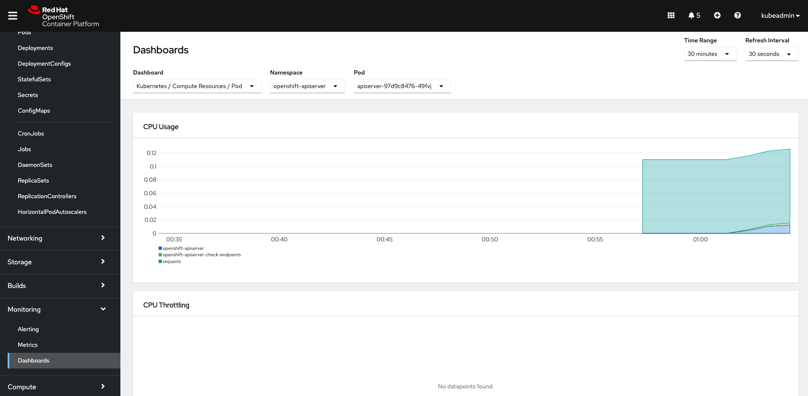
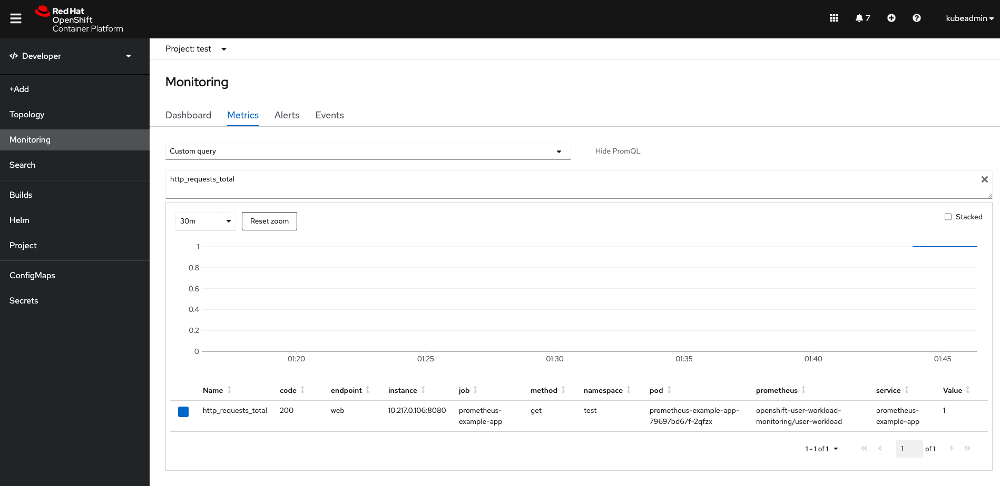
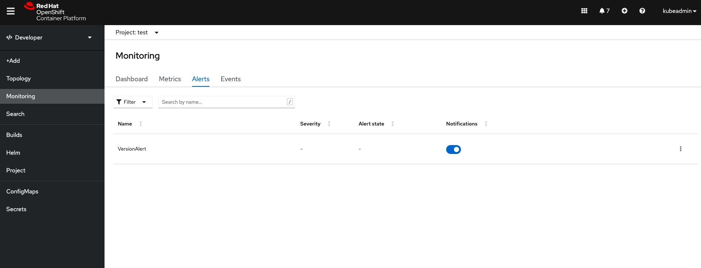
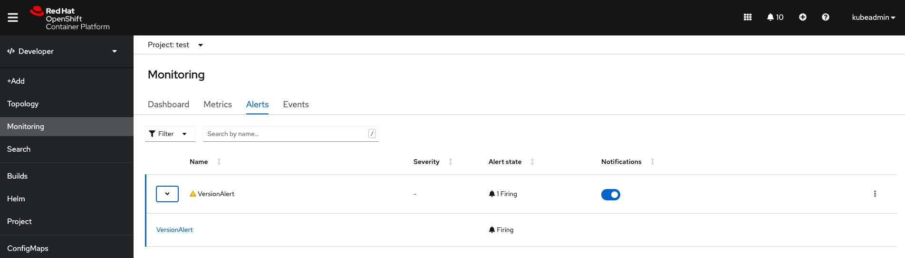

# Monitoring


## Prerequisites

Having completed the following labs:

- [00 - Prerequisites](../00-Prerequisites/README.md)
- [02 - Provision the environment](../02-Provision_the_environment/README.md)
- [03 - OKD login](../03-OKD_login/README.md)
- [04 - Project](../04-Project/README.md)

Having logged in using the **kubeadmin** account:

```console
$ oc login -u kubeadmin -p dpDFV-xamBW-kKAk3-Fi6Lg https://api.crc.testing:6443
Login successful.

You have access to 58 projects, the list has been suppressed. You can list all projects with 'oc projects'

Using project "test".
```

Make sure to use the **test** project.

```console
$ oc project test
Already on project "test" on server "https://api.crc.testing:6443".
```

## Enanble monitoring 

Before running this lab, you have to enable monitoring API (thus the **cluster-monitoring-operator** operator)

Run this command, and note down the integer ID near to **cluster-monitoring-operator** (in this case is **0**).

```
$ oc get clusterversion version -ojsonpath='{range .spec.overrides[*]}{.name}{"\n"}{end}' | nl -v 0
     0  cluster-monitoring-operator
     1  machine-config-operator
     2  etcd-quorum-guard
     3  machine-api-operator
     4  cluster-autoscaler-operator
     5  insights-operator
     6  prometheus-k8s
     7  cloud-credential-operator
     8  csi-snapshot-controller-operator
     9  cluster-storage-operator
    10  kube-storage-version-migrator-operator
    11  cluster-node-tuning-operator
```

Then, run this command below using the integer ID you took from the last one as the final element of path **/spec/overrides/** (in this case the result path will be **/spec/overrides/0**).

```console
$ oc patch clusterversion/version --type='json' -p '[{"op":"remove", "path":"/spec/overrides/0"}]'  
clusterversion.config.openshift.io/version patched
```

In this way, after a couple of minutes, all the necessary Pods will be up and running and let you inspect the OpenShift cluster metrics.

To check that everything works as expected (pay attention to be logged in as **kubeadmin**):

```console
$ oc get pods -n openshift-monitoring
NAME                                          READY   STATUS       RESTARTS   AGE
alertmanager-main-0                           5/5     Running      0          7h15m
alertmanager-main-1                           5/5     Running      0          7h15m
alertmanager-main-2                           5/5     Running      0          7h15m
cluster-monitoring-operator-f557f6c97-gmt8m   2/2     Running      0          7h17m
grafana-689d8d5766-5nw5m                      2/2     Running      0          7h16m
kube-state-metrics-cf7bc857f-6n88b            3/3     Running      0          7h16m
node-exporter-9m82c                           2/2     Running      0          7h16m
openshift-state-metrics-85b46b6f6c-5cvwn      3/3     Running      0          58m
openshift-state-metrics-85b46b6f6c-rpm48      0/3     Preempting   0          61m
openshift-state-metrics-85b46b6f6c-zn6vp      0/3     Preempting   0          7h16m
prometheus-adapter-5cfd948cd8-9lfwg           1/1     Running      0          7h16m
prometheus-adapter-5cfd948cd8-kfjkj           1/1     Running      0          7h16m
prometheus-k8s-0                              7/7     Running      1          7h14m
prometheus-k8s-1                              7/7     Running      1          7h14m
prometheus-operator-6867b84869-4h65k          2/2     Running      3          7h16m
telemeter-client-77f9c75896-dgdzh             3/3     Running      0          7h16m
thanos-querier-5f6dc9f8c5-6qgb2               4/4     Running      1          7h16m
thanos-querier-5f6dc9f8c5-p64lq               4/4     Running      1          7h16m
```

If one ore more Pods are not **Running** can be a memory/cpu issue. To increase the resources of CRC VM plase have a look of the [Provision the environment lab](../02-Provision_the_environment/4.x/CodeReadyContainers/README.md)


After a couple of minutes, you should see the first metrics arrive into the built-in monitoring dashboards



## Prometheus Operator endpoint to scrape autoconfiguration

Next step is to build upon this configuration to start monitoring any other services deployed in your cluster.

There are two custom resources involved in this process:

- The Prometheus CRD
  - Defines Prometheus server pod metadata
  - Defines # of Prometheus server replicas
  - Defines Alertmanager(s) endpoint to send triggered alert rules
  - Defines labels and namespace filters for the 
    - ServiceMonitor CRDs that will be applied by this Prometheus server deployment

- The ServiceMonitor objects will provide the dynamic target endpoint configuration
  - The ServiceMonitor CRD
  - Filters endpoints by namespace, labels, etc
  - Defines the different scraping ports
  - Defines all the additional scraping parameters like scraping interval, protocol to use, TLS credentials, re-labeling policies, etc.

The Prometheus object filters and selects N ServiceMonitor objects, which in turn, filter and select N Prometheus metrics endpoints.

If there is a new metrics endpoint that matches the ServiceMonitor criteria, this target will be automatically added to all the Prometheus servers that select that ServiceMonitor.


As you can see in the diagram above, the ServiceMonitor targets Kubernetes services, not the endpoints directly exposed by the pod(s).

## Enabling monitoring for user-defined projects

```console
$ oc apply -f cluster-monitoring-config.yaml 
configmap/cluster-monitoring-config created
```

Check that the prometheus-operator, prometheus-user-workload and thanos-ruler-user-workload pods are running in the openshift-user-workload-monitoring project. It might take a short while for the pods to start:

```console
$ oc -n openshift-user-workload-monitoring get pod
NAME                                 READY   STATUS    RESTARTS   AGE
prometheus-operator-9c8c8bcf-6tz8l   2/2     Running   0          3m5s
prometheus-user-workload-0           5/5     Running   1          2m32s
prometheus-user-workload-1           5/5     Running   1          2m31s
thanos-ruler-user-workload-0         3/3     Running   0          2m37s
thanos-ruler-user-workload-1         3/3     Running   0          2m37s
```

You can grant users permissions to monitor their own projects, by using the OpenShift CLI (oc).

```console
$ oc policy add-role-to-user monitoring-edit developer -n test    
clusterrole.rbac.authorization.k8s.io/monitoring-edit added: "developer"
```

You can grant users permission to configure monitoring for user-defined projects.

 ```console
$ oc -n openshift-user-workload-monitoring adm policy add-role-to-user \
  user-workload-monitoring-config-edit developer \
  --role-namespace openshift-user-workload-monitoring
role.rbac.authorization.k8s.io/user-workload-monitoring-config-edit added: "developer"
```

## Create a custom application to be monitored

We need a service to scrape: 

```console
$ oc apply -f example_app.yaml
deployment.apps/prometheus-example-app created
service/prometheus-example-app created
```


The example application exposes its metrics at port 8080

```
$ oc get svc 
NAME                     TYPE        CLUSTER-IP     EXTERNAL-IP   PORT(S)    AGE
prometheus-example-app   ClusterIP   10.217.5.246   <none>        8080/TCP   38s
```

To test the application metrics

```console
$ oc run -i --rm --tty busybox --image=busybox --restart=Never -- wget -qO- prometheus-example-app:8080/metrics 
# HELP http_requests_total Count of all HTTP requests
# TYPE http_requests_total counter
http_requests_total{code="200",method="get"} 1
# HELP version Version information about this binary
# TYPE version gauge
version{version="v0.1.0"} 1
pod "busybox" deleted
```

Let's apply the [ServiceMonitor](example-servicemonitor.yaml)

```
$ oc apply -f example-servicemonitor.yaml
servicemonitor.monitoring.coreos.com/prometheus-example-monitor created
```

```console
$ oc get servicemonitor
NAME                     AGE
prometheus-example-monitor   15s
```

If open the monitoring page on the OpenShift web console (Developer perspective), you can see the metrics coming from our service monitor



Reference: https://docs.openshift.com/container-platform/4.7/monitoring/managing-metrics.html


## How to configure Alert Rules

In this demo we configure a rule named example-alert that fires an alert when the version metric exposed by the sample service becomes 0.

```
$ oc apply -f alert-rule.yaml
prometheusrule.monitoring.coreos.com/example-alert created
```
Now that the rule is in place, we should see it in the Alert tab as well (use the Developer perspective)




To test it, stop the monitored pod

```console
$ kubectl delete deploy prometheus-example-app
deployment.apps "prometheus-example-app" deleted
```

After a couple of minutes we should see also an alert being triggered:

